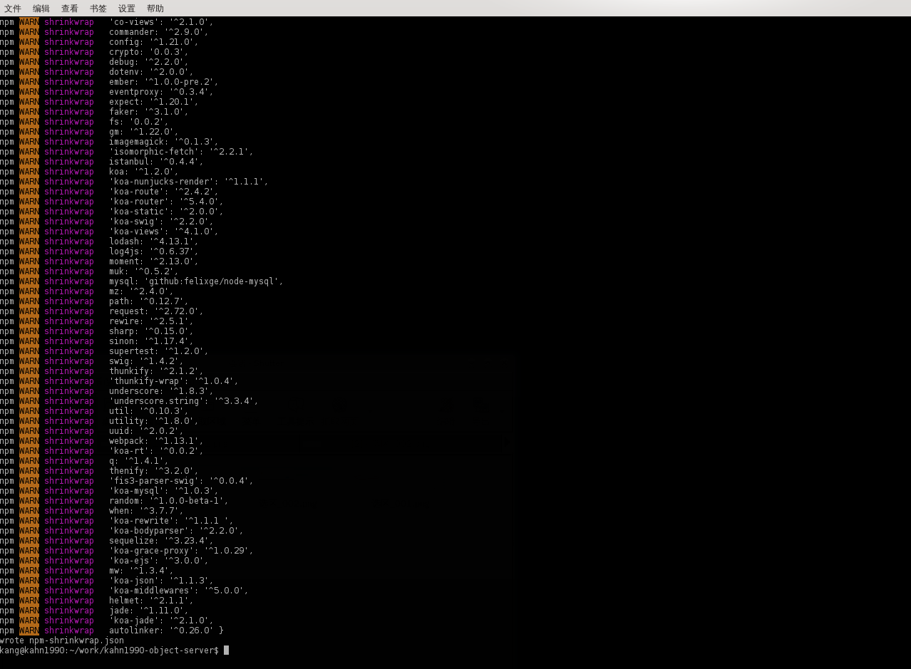
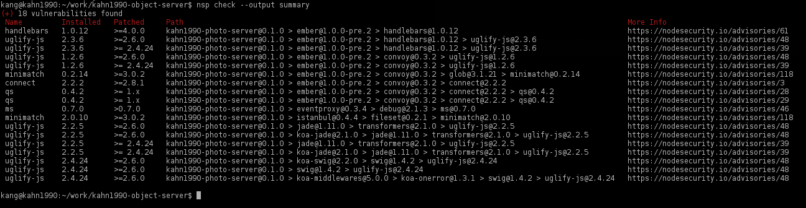
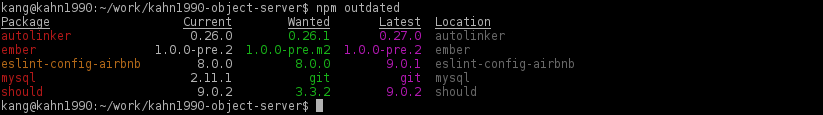
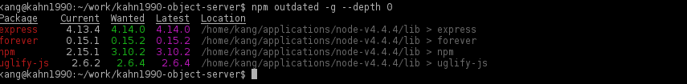
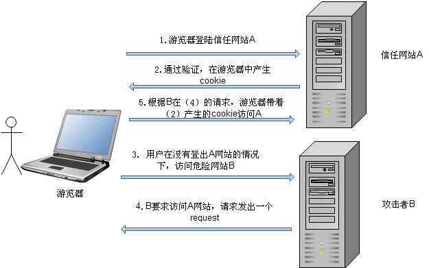
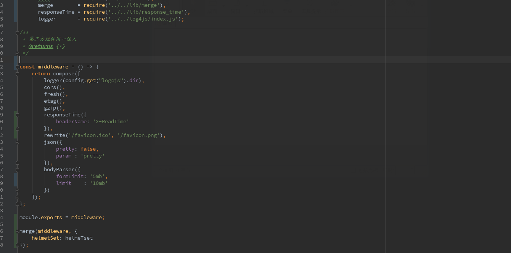

# 规范化安全开发 KOA 手脚架

刚接触 KOA 的时候心理也有一点点担忧，KOA 是一个轻量级的框架，这意味着我们想要做好一个理想的手脚架需要自己去改变很多东西，一些流行的 npm 第三方更要做好处理，那么时间成本会逐级的提高。

[koa-rack](https://github.com/kahn1990/koa-rack)

## 项目目录

```js
.
├── app.js
├── config
├── controllers
├── doc
├── dox.config.json
├── ecosystem.json
├── index.js
├── jsdoc-conf.json
├── lib
├── log4js
├── Makefile
├── models
├── node_modules
├── npm-shrinkwrap.json
├── oneapm.js
├── package.json
├── proxy
├── README.md
├── routes
├── server
├── sql
├── start.sh
├── static
├── test
├── views
└── webpack.config.js
```

### config

> npm i config --save

`config` 这个文件夹的作用是用来做开发环境、生产环境和测试环境的配制工作，依赖于 `config` 组件，目录下以此建立相关的配置文件：

```js
.
├── default.json
├── development.json
├── production.json
├── readme.md
└── test.json
```
在 `json` 后缀的文件无法做注释，所以添加 `readme.md` 文件做配置文件的说明。这个只是我自己的习惯，实际上 `config` 组件支持多种文件格式，它的机理就是通过判断 `NODE_ENV` 然后分别加载 `config` 文件夹下的文件。

### doc

> npm i json-zero -g

文档文件夹。这里我采用 `json-zero` 组件进行注释文档生成。

### lib

函数文件夹。

### log4js

> npm i log4js --save

扩展 log4js 的日志输出，这里面还是有一点门道的，因为 KOA 与 EXPRESS 并不相同，所以想要在 KOA上合理的使用 log4js 是要下一点心思去二次封装一下，以便适应自己的项目。

### controllers

`controllers` 文件夹保存控制器

```js
.
└── web
    └── user
        └── index.js
```
控制器通过 `yield` 来读取 `User` 内的数据
```
const User   = require('../../../models/web/index');
module.exports.home = function*() {
    var data = yield User.test({});
};
```
### routes
```
.
├── index.js
└── web
```
路由器文件夹，定义 `http` 的请求指向控制器：
```
const router = require('koa-router')(),
      debug  = require('debug')('app:routes:index');
/**
 * 引入控制器
 */
var Web = require('./../controllers/web/user/index');
/**
 * 主页
 */
router.get('/', Web.home);
module.exports = router;
```
### views
```
.
├── 400.html
├── 500.html
└── home.html
```
视图文件夹。

### models

数据层文件夹。
```
.
├── db
│   ├── mysql_orm.js
│   └── mysql_pool.js
└── web
    ├── index.js
    └── table
        ├── index.js
        └── photo.js
```
`db` 文件夹定义两种连接 `mysql` 的方式，`web` 里面就是具体的业务代码。

以上四个文件组成了这个手脚架的基础业务处理逻辑：


这个架构过程是灵活多变的，完全可以根据自己的需要进行取舍和重构，我只所以将路由和控制器分开成两个文件夹，更多的是考虑到当一个项目区分 n 个模块的时候，彼此之间相互独立却又有一些相同的 api 接口，那么这样架构可以更清晰的区分和查找接口。

我在15年和16年上半年之间经历过一个项目，使用 node 做中间层，本来一切顺利，但是苦于后端 java 根据业务调整频繁更换和更改 api 接口，造成了非常大的重复工作。渐渐的我就摸索出一套设计中间层的经验，在我们直接引用外部 api 接口之前，不要相信它是一成不变的，不要相信它是永远存在的，不要相信它是必要的。在此基础上根据功能分成若干模块，稍微费点心力进行二次封装然后再进行引用，封装的时候尽量考虑他不是唯一接口，并提供便捷和可替换性。

## 入口文件

入口文件将它拆分为几个部分：
```
.
├── app.js
├── index.js
├── Makefile
├── server
│   ├── api
│   ├── auth
│   ├── index.js
│   ├── lib
│   │   ├── compose.js
│   │   ├── cors.js
│   │   ├── etag.js
│   │   ├── fresh.js
│   │   ├── gzip.js
│   │   └── ketag.js
│   └── middleware
│       ├── helmet_set.js
│       └── index.js
├── start.sh
└── static
```
这里我需要吐槽一下 grunt 和 gulp，发明 grunt 和 gulp 的人一定是天才，但是它俩真的没有想象中那么好用，我宁愿使用 npm script 或者 makefile。
因为 KOA 的 generator 相关的特性，我们必须将很多流行的第三方进行改造，我建议不要去找 npm 库里的那些已经改造好的组件，那些大多版本落后，自力更生比较好一些。

## 安全相关

### helmet

helmet 是一个很流行的组件，用于处理一些常见的安全问题。

### etag

处理静态资源响应时间。

## 一些细节

在使用 npm 的时候一些细节处理可以让我们更方便的管理和认知整个项目的依赖结构，比如 [Node Security project(nsp)](https://github.com/nodesecurity/nsp)、[david](https://www.npmjs.com/package/david) 等。

### [Node Security project(nsp)](https://github.com/nodesecurity/nsp)

> npm i nsp nsp-formatter-checkstyle -g

nsp 应该属于安全系列的组件之一，它可以检查你使用的模块是否是易被一些已知的手段攻击，并给一个包的所有依赖关系上锁，并且创建一个 `npm-shrinkwrap.json` 文件。
这里有个前提是 `node_modules` 与 `package.json` 之间的对应关系必须正确，否则的话会报错，可以利用这一特性来检查是否有 `node_modules` 中的组件没有在 `package.json` 中标明，反之亦然。很好用的工具。

> npm shrinkwrap



如果想要包含 dependencies and devDependencies 需要添加 `--dev`:

> npm shrinkwrap --dev

检查：

> nsp check --output summary



> nsp check --output checkstyle

在根目录下创建 `.nsprc` 文件：

### [retire](https://www.npmjs.com/package/retire)

> npm i -g retire

retire.js是一个命令行扫描器，帮助你找到你应用中依赖库存在的漏洞。

### [david](https://www.npmjs.com/package/david)

> $ npm install david -g

david 检查 npm 组件更新，执行命令

> david


检查全局模块

> david -g


### [npm outdated](https://docs.npmjs.com/cli/outdated)

> $ npm outdated



> $ npm outdated -g --depth 0




# 跨站请求伪造 CSRF（Cross-Site Request Forgery）

CSRF 是一种挟制终端用户在当前已登录的Web应用程序上执行非本意的操作的攻击方法。
更具体的可以参考 [浅谈 CSRF](http://www.cnblogs.com/hyddd/archive/2009/04/09/1432744.html) 或者 [CSRF 攻击的应对之道](http://www.ibm.com/developerworks/cn/web/1102_niugang_csrf/)。



（请原谅我的盗图，程序员的盗图能叫盗么 (╬▔▽▔)凸，只是偶尔犯了懒癌不愿意自己画好不好 (╬▔▽▔)凸 (╬▔▽▔)凸）

## 同步令牌模式（Synchronizer Token Pattern）

- 当一个 GET 请求被服务检查为 CSRF 令牌，如果不存在，就创建一个
- 当用户输入显示时，确保要添加一个隐形的 CSRF 令牌值
- 当发送表单时，确保值是来自表单并且要与 session 相匹配

常见的第三方集成：

- [csurf](https://www.npmjs.com/package/csurf)
    - `$ npm i csurf --save`
- [koa-csrf](https://github.com/koajs/csrf)
    - `$ npm install koa-csrf`

这里我使用的是 koa-csrf。

# [Helmet](https://www.npmjs.com/package/helmet)

- `$ npm install helmet --save`

Helmet 安全功能有:

- [contentSecurityPolicy](https://github.com/helmetjs/csp) 通过设置Content-Security-Policy来阻止XSS攻击和一些其他的跨站注入风险
    - 内容安全策略（CSP）：CSP（Content Security Policy）是一个额外添加的安全层，它有助于检测和减轻某些类型的攻击，包括跨站脚本（XSS）和数据注入攻击。 通过HTTP header中的Content-Security-Policy方法来启动CSP。
        - https://www.owasp.org/index.php/Testing_for_Reflected_Cross_site_scripting_%28OWASP-DV-001%29
- [dnsPrefetchControl](https://github.com/helmetjs/dns-prefetch-control) controls browser DNS prefetching
- [frameguard](https://github.com/helmetjs/frameguard) 设置X-Frame-Options阻止点击劫持风险
- [hidePoweredBy](https://github.com/helmetjs/hide-powered-by) 删除了header中的X-Powered-By标签
    - `app.disable('x-powered-by');`：禁用X-Powered-By头
        - http://scottksmith.com/blog/2014/09/21/protect-your-node-apps-noggin-with-helmet/
- [hpkp](https://github.com/helmetjs/hpkp) 通过增加Public key Pinning来阻止伪造证书导致的中间人攻击
- [hsts](https://github.com/helmetjs/hsts) 设置 Strict-Transport-Security 来强制安全连接(http over SSL)到服务器（服务器需要支持https）
- [ieNoOpen](https://github.com/helmetjs/ienoopen) 为ie8设置 X-Download-Options
- [noCache](https://github.com/helmetjs/nocache) 设置Cache-Control关闭客户端缓存
- [noSniff](https://github.com/helmetjs/dont-sniff-mimetype) 设置X-Content-Type-Options阻止浏览器MIME-sniffing。
- [xssFilter](https://github.com/helmetjs/x-xss-protection) 设置X-XSS-Protection启用XSS过滤器
- [dnsPrefetchControl](https://github.com/helmetjs/dns-prefetch-control) DNS 

用法：

调用 `app.use(helmet());` 可以缺省激活上述 10 项功能的7项，排除的两项是 `contentSecurityPolicy` 、 `dnsPrefetchControl`和 `noCache`。

为了迎合新版本的 Helmet，我不得不放弃 koa-helmet，koa-helmet 依赖的 Helmet 版本太低了，所以只好自己 copy 一个文件加工成中间件：


再绑定到 middleware 上：



以下是一些安全性相关的HTTP头：

- Strict-Transport-Security：强制使用安全连接（SSL/TLS之上的HTTPS）来连接到服务器。
- X-Frame-Options：提供对于“点击劫持”的保护。
- X-XSS-Protection：开启大多现代浏览器内建的对于跨站脚本攻击（XSS）的过滤功能。
- X-Content-Type-Options： 防止浏览器使用MIME-sniffing来确定响应的类型，转而使用明确的content-type来确定。
- Content-Security-Policy：防止受到跨站脚本攻击以及其他跨站注入攻击。

# 身份认证

## 暴力破解的保护

- [ratelimiter](https://www.npmjs.com/package/ratelimiter)
- [koa-ratelimit](https://www.npmjs.com/package/koa-ratelimit)

通过限制用户的连接频率来防止这类的攻击:

    var ratelimit = require('koa-ratelimit');  
    var redis = require('redis');  
    var koa = require('koa');  
    var app = koa();
    
    var emailBasedRatelimit = ratelimit({  
      db: redis.createClient(),
      duration: 60000,
      max: 10,
      id: function (context) {
        return context.body.email;
      }
    });
    
    var ipBasedRatelimit = ratelimit({  
      db: redis.createClient(),
      duration: 60000,
      max: 10,
      id: function (context) {
        return context.ip;
      }
    });
    
    app.post('/login', ipBasedRatelimit, emailBasedRatelimit, handleLogin); 
    
## 其他

- [StrongLoop API Gateway](https://strongloop.com/node-js/api-gateway/?_ga=1.201809873.1196661681.1453521338) ：使用提交速率限制，防止蛮力攻击
- [express-limiter](https://www.npmjs.com/package/express-limiter) ：使用提交速率限制，防止蛮力攻击
- [thc-hydra](https://github.com/vanhauser-thc/thc-hydra) ：提交限制测试

#  Session、Cookie

> $ npm install koa-session
    
## cookie可以设置的属性的列表：

- secure - 这个属性告诉浏览器，仅在请求是通过HTTPS传输时，才传递cookie。
- HttpOnly - 设置这个属性将禁止javascript脚本获取到这个cookie，这可以用来帮助防止跨站脚本攻击。
- Cookie域
    - domain - 这个属性用来比较请求URL中服务端的域名。如果域名匹配成功，或这是其子域名，则继续检查path属性。
    - path - 除了域名，cookie可用的URL路径也可以被指定。当域名和路径都匹配时，cookie才会随请求发送。
    - expires - 这个属性用来设置持久化的cookie，当设置了它之后，cookie在指定的时间到达之前都不会过期。

示例代码：

    app.use(session({
            overwrite: true,
            httpOnly : true,
            signed   : true,
            key      : 'kos',
            maxAge   : 1000 * 3600 * 24 * 30
        },
        app
    ));

# 数据合法性

##  XSS

- 跨站脚本
- 存储

非持久化的XSS攻击 在攻击者向指定的URL的响应HTML中注入可执行的JavaScript代码时发生。
持久化的XSS攻击 在应用存储未经过滤的用户输入时发生。用户输入的代码会在你的应用环境下执行。
为了防御这类攻击，请确保你总是检查并过滤了用户的输入内容。

## SQL注入

最简单的预防方法则是使用参数化查询（parameterized queries）或预处理语句（prepared statements）。

### [sqlmap](http://sqlmap.org/)

sqlmap 可以检测是否存在sql注入的风险。这里有一篇教程 http://www.freebuf.com/articles/web/29942.html

https://asciinema.org/a/46601

### orm2

mysql orm 服务。

# 安全传输

- nmap
- sslyze

检查证书信息

> $ nmap --script ssl-cert,ssl-enum-ciphers -p 443,465,993,995 www.example.com

或者：

> $ ./sslyze.py --regular example.com:443

# 正则表达式（Evil Regexes）

## [safe-regex](https://www.npmjs.com/package/safe-regex)

可以确保你的正则表达式不会成为正则表达式DOS攻击的受害者

## SSL

- [namp](https://nmap.org/) ：测试你的SSL配置以及验证认证的有效性
- [sslyze](https://github.com/nabla-c0d3/sslyze) ：测试你的SSL配置以及验证认证的有效性


# 单元测试

[单元测试准则](https://github.com/yangyubo/zh-unit-testing-guidelines)

- TDD（测试驱动开发）
- BDD（行为驱动开发）

区别：

    // TDD
    suite('Array', function() {
      setup(function() {
      });
     
      test('equal -1 when index beyond array length', function() {
        assert.equal(-1, [1,2,3].indexOf(4));
      });
    });
     
    // BDD
    describe('Array', function() {
      before(function() {
      });
     
      it('should return -1 when no such index', function() {
        [1,2,3].indexOf(4).should.equal(-1);
      });
    });

## mocha

    $npm install -g mocha
 
1. mocha（Mocha is a feature-rich JavaScript test framework running on node.js and the browser, making asynchronous testing simple and fun.）
1. chai（Chai is a BDD / TDD assertion library for node and the browser that can be delightfully paired with any javascript testing framework.）
1. sinon（Standalone test spies, stubs and mocks for JavaScript.）
1. zombie (页面事件模拟Zombie.js is a lightweight framework for testing client-side JavaScript code in a simulated environment. No browser required.)
1. supertest(接口测试 Super-agent driven library for testing node.js HTTP servers using a fluent API)

辅助工具：

- 断言库：
    - [should.js](https://github.com/tj/should.js)：should 是一个表述性、可读性很强的测试无关的“断言”库。它是BDD风格的，用一个单例的不可枚举的属性访问器扩展了Object的prototype，允许你表述对象应该展示的行为。
    - Chai
    - expect.js
    - assert.js
- Web测试
    - supertest：supertest 是一个非常棒的适用于node的模拟HTTP请求的库
- cucumber（敏捷）
    - https://github.com/cucumber/cucumber-js
- vowsjs （敏捷）
    - http://vowsjs.org/
- 测试私有方法
    - rewire    
- Mock库
    - muk
- 模拟用户数据
    - faker

### 异步操作的测试

    describe('User', function() {
        describe('#save()', function() {
            it('should save without error', function(done) {
                var user = new User('Luna');
                user.save(done);
            });
        });
    });
    
### 具备正反测试用例

    describe('sign up', function() {
      it('should not sign up an user when loginname is empty', function(done) {
        request.post('/signup')
        .send({
          loginname: '',
          password: password
        })
        .expect(200, function(err, res) {
          should.not.exist(err);
          res.text.should.containEql('用户名或密码不能为空');
          done();
        });
      });
      it('should not sign up an user when it is exist', function(done) {
        request.post('/signup')
        .send({
          loginname: loginname,
          password: password
        })
        .expect(200, function(err, res) {
          should.not.exist(err);
          res.text.should.containEql('用户已经存在');
          done();
        });
      });
    });
    
### 需要cookie和session的测试案例

    set('Cookie', cookieValue)
    
    app.use(function(req, res, next) {
      if (config.debug && req.cookies['mock_user']) {
        var mockUser = JSON.parse(req.cookies['mock_user']);
            req.session.user = new UserModel(mockUser);
            return next();
      }
      next();
    });
    
 
### 其他解决方案

- tape
    - https://github.com/substack/tape
    - https://en.wikipedia.org/wiki/Test_Anything_Protocol
- tap
    - https://github.com/isaacs/node-tap
- Jasmine
- qunit
- sinon
   
## 测试覆盖率 && 测试报告

[代码覆盖率 code coverage](https://en.wikipedia.org/wiki/Code_coverage)

1. 行覆盖率（line coverage）：是否每一行都执行
1. 函数覆盖率（function coverage）：是否每个函数都调用
1. 分支覆盖率（branch coverage）：是否每个if代码块都执行
1. 语句覆盖率（statement coverage）：是否每个语句都执行

### [coveralls](https://coveralls.io/)

创建 `.coveralls.yml`

并在 Makefile 添加（示例）：

    TESTS = test/*.js
    REPORTER = spec
    TIMEOUT = 20000
    ISTANBUL = ./node_modules/.bin/istanbul
    MOCHA = ./node_modules/mocha/bin/_mocha
    COVERALLS = ./node_modules/coveralls/bin/coveralls.js
    
    test:
    	@NODE_ENV=test $(MOCHA) -R $(REPORTER) -t $(TIMEOUT) \
    		$(MOCHA_OPTS) \
    		$(TESTS)
    
    test-cov:
    	@$(ISTANBUL) cover --report html $(MOCHA) -- -t $(TIMEOUT) -R spec $(TESTS)
    
    test-coveralls:
    	@$(ISTANBUL) cover --report lcovonly $(MOCHA) -- -t $(TIMEOUT) -R spec $(TESTS)
    	@echo TRAVIS_JOB_ID $(TRAVIS_JOB_ID)
    	@cat ./coverage/lcov.info | $(COVERALLS) && rm -rf ./coverage
    
    test-all: test test-coveralls
    
    .PHONY: test

或者

    TESTS = test/*.test.js
    REPORTER = spec
    TIMEOUT = 10000
    JSCOVERAGE = ./node_modules/jscover/bin/jscover
    
    test:
        @NODE_ENV=test ./node_modules/mocha/bin/mocha -R $(REPORTER) -t $(TIMEOUT) $(TESTS)
    
    test-cov: lib-cov
        @LIB_COV=1 $(MAKE) test REPORTER=dot
        @LIB_COV=1 $(MAKE) test REPORTER=html-cov > coverage.html
    
    lib-cov:
        @rm -rf ./lib-cov
        @$(JSCOVERAGE) lib lib-cov
    
    .PHONY: test test-cov lib-cov
    
    make test
    make test-cov
    
都是用以参考

### [istanbul](https://github.com/gotwarlost/istanbul)

可以通过3种途径生成覆盖报告

- cli
- 代码
- gulp 插件

安装：

    $ npm install -g istanbul

执行：

    $ istanbul cover my-test-script.js -- my test args

会生成./coverage目录，这里面就是测试报告

### 示例 package.json 配置：

    "scripts": {
      "start": "npm publish .",
      "test": "./node_modules/.bin/gulp",
      "mocha": "./node_modules/.bin/mocha -u bdd",
      "cov":"./node_modules/.bin/istanbul cover ./node_modules/mocha/bin/_mocha --report lcovonly -- -R spec && cat ./coverage/lcov.info | ./node_modules/coveralls/bin/coveralls.js && rm -rf ./coverage"
    }

执行：

    npm run mocha
    npm run cov

### 其他解决方案：

- jscover
- blanket

## Continuous integration 持续集成（CI）

持续集成是一种软件开发实践，即团队开发成员经常集成他们的工作，通常每个成员每天至少集成一次，也就意味着每天可能会发生多次集成。每次集成都通过自动化的构建（包括编译，发布，自动化测试)来验证，从而尽快地发现集成错误。许多团队发现这个过程可以大大减少集成的问题，让团队能够更快的开发内聚的软件。
也就是说，测试不通过不能部署，只有提交到服务器上，就可以自动跑测试，测试通过后，就可以部署到服务器上。
### 软件

- jenkins（自搭建）
    - https://jenkins.io/index.html
- travis（开源）
    - https://travis-ci.org/

## [oneapm](http://www.oneapm.com/) 性能监控

### Agent

1.2.8 以下的版本，请在应用程序的根目录下运行以下指令：

    npm install oneapm --registry http://npm.oneapm.com
    
1.2.8 及以上的版本，请在应用程序的根目录下运行以下指令：

    npm install oneapm
    
等待安装成功

###  配置

将 node_modules/oneapm 中的 oneapm.js 文件复制到应用程序的根目录下
修改配置文件 oneapm.js，设置 app_name，将 license_key 替换为 OneAPM 提供的license_key
复制以下代码至应用程序主模块文件第一行

    require('oneapm');

## API响应时间监测

- Grafana
    - Gra 用作数据呈现，封面截图就来自Gra。
- Telegraf
    - Telegraf 是安装于生产机的守护进程，用于埋点数据收集并转发到Gra数据库，并收集宿主机负载信息。
- InfluxDB
    - Inf是 time-series data 类型的数据库，支持类sql语句查询，适合监控数据存储，实时分析。

## 参考

https://github.com/JacksonTian/unittesting
http://html5ify.com/unittesting/slides/index.html
http://www.ruanyifeng.com/blog/2015/06/istanbul.html
http://coolshell.cn/articles/8209.html
http://stackoverflow.com/questions/153234/how-deep-are-your-unit-tests
https://github.com/yangyubo/zh-unit-testing-guidelines
http://www.codedata.com.tw/java/unit-test-the-way-changes-my-programming
http://wiki.ubuntu.org.cn/%E8%B7%9F%E6%88%91%E4%B8%80%E8%B5%B7%E5%86%99Makefile:MakeFile%E4%BB%8B%E7%BB%8D
https://github.com/yangyubo/zh-unit-testing-guidelines
https://github.com/visionmedia/superagent/blob/master/Makefile
http://www.open-open.com/lib/view/open1452168729620.html
http://www.oneapm.com/
http://grafana.org/
https://influxdata.com/
https://influxdata.com/time-series-platform/telegraf/
http://martinfowler.com/bliki/IntegrationContractTest.html 契约测试

## 工具集


### 在线 Web 页面性能评测工具

- [WebPagetest](http://www.webpagetest.org/)
- [Testcafe](http://testcafe.devexpress.com/)
    - Web 测试框架。它支持所有主流浏览器，操作系统和移动平台，支持远程设备，多浏览器并行测试。Testcafe 内置一个可视化测试记录器，支持持续集成，脚本标记分析等强大功能。
 - [Cuzillion](http://www.stevesouders.com/cuzillion/?ex=1&title=Inline+Scripts+Block+Rendering)
     - Cuzillion是一个很酷的工具，帮助你查看页面组件的交互，目标是帮助你在结构化页面的时候快速检查，测试和编辑web页面。
        
## 图形化请求测试工具

- [RESTClient](http://www.restclient.org/)
- [HttpRequester](https://sourceforge.net/projects/httprequester/)
- [HttpWatch](http://www.httpwatch.com/)
    - HTTP嗅探器，为IE和Firefox提供新的方法以查看您网站的负载和运行情况，可以监控请求头，响应头，显示资源加载瀑布图。
- [VB Watch](http://vb-watch.updatestar.com/)
    - VB Watch 是三种工具之一：Profiler, Protector 以及 Debugger. Profiler 衡量性能及测试覆盖率。 Protector 实现健壮的错误处理。 Debugger 有助于监控你的可执行文件。
- [Speed Tracer](http://www.speedtracer.com/)
    - Speed Tracer由Google开发的一款测试网页性能分析插件，而且开源。
    
- Performance Analyser
    - Performance Analyser可以自动分析网页性能，同时为你提供详细的性能指标。
- YSlow for Chrome
    - YSlow for Chrome是一款由Yahoo开发网站性能优化扩展，在十几个方面给你的网站提出优化建议，包括尽可能的减少 HTTP 的请求数 、使用 Gzip 压缩、将 CSS 样式放在页面的上方、将脚本移动到底部、减少 DNS 查询等十几条规则。
- Wireshark
    - Wireshark(前称Ethereal)是一个网络封包分析软件。网络封包分析软件的功能是撷取网络封包, 并尽可能显示出最为详细的网络封包资料。
- PageSpeed
    - Page Speed 是开源 Firefox/Firebug 插件，网站管理员和网络开发人员可以使用 Page Speed 来评估他们网页的性能，并获得有关如何改进性能的建议。
- dynaTrace Ajax Edition
    - dynaTrace Ajax Edition 是一个强大的底层追踪、前端性能分析工具。您可以利用它来分析页面渲染时间、DOM方法执行时间，甚至可以看到JS代码的解析时间。
- HTTP Archive
    - HTTP Archive可追踪网站的构建。HTTP Archive的代码开源，下载地址。
- PageSpeed Insights
    - PageSpeed Insights是谷歌推出的一款性能优化工具，其目的是帮助站长优化页面，从而能够带来最佳的渲染性能，尤其实针对移动页面。
- PhantomJS
    - PhantomJS是一款前端自动化测试工具。它本质上是一个基于webkit内核的无界面浏览器，并可使用JavaScript或CoffeeScript进行编程。
- Weinre
    - Weinre代表We b In spector Re mote，是一种远程调试工具。举个例子，在电脑上可以即时 的更改手机上对应网页的页面元素、样式表，或是查看Javascript变量，同时还可以看到手机上页面的错误和警告信息。
- Opera Dragonfly
    - Opera Dragonfly 是适用于 Opera 浏览器的跨设备、跨平台的调试环境 - 调试 JavaScript、检查和编辑 CSS 与 DOM,以及查看手机或计算机上的任何错误。
- Chrome for Android
    - Chrome for Android可在Android上远程调试Chrome浏览器。
- Apache Bench (ab)
    - ApacheBench 主要是用来测试阿帕奇服务器执行效率用的。
- Show Slow
    - Show Slow是一个开源的基于web的工具，用来收集从Page Speed获得的性能参数。
- Browserscope
    - Browserscope 是一个开源项目，用于测试Web浏览器的性能，如程序概要分析，存储和收集crowd-sourced数据等。
- DOM Monster
    - DOM Monster 由script.aculo.us的作者开发的一个用于分析Web页面的DOM和其它特性。它能够检查HTML+JavaScript代码，并一些警告和建议如：减少使用样式属性的标签数量；查找JavaScript全局变量，并减少它们以便改进性能等。
- Mobileperf Bookmarklet
    - Mobileperf Bookmarklet是针对于移动设备的Web调试器和分析器。
- Redbot
    - 这是一个机器人工具，帮助用户检查HTTP资源，可查看它的操作情况，指出常见的问题并提出改进。
- Boomerang
    - Boomerang是由雅虎Exceptional Performance(异常性能)小组发布的网站性能监测工具，能从最终用户的角度来衡量网站性能，并将数据发送回服务器以便进一步分析。
- Wappalyzer
    - Wappalyzer插件可以告诉你当前正在访问的网页是采用什么软件搭建的。它能够检测出CMS和电子商务系统、留言板、javascript框架，主机面板，分析统计工具和其它的一些web系统。
- Netalyzer
    - Netalyzer是一款用于搜集域名、跟踪路由器信息的小型工具。
- Shunra NetworkCatcher Express
    - Shunra NetworkCatcher是一款高度灵活的、功能强大的网络监控工具，使企业能够轻松准确地记录、导入、重播真实网络行为，如延迟，丢包和可用带宽。
- Fiddler
    - Fiddler是最强大最好用的Web调试工具之一，它能记录所有客户端和服务器的http和https请求，允许你监视，设置断点，甚至修改输入输出数据。
- Charles
    - Charles是一个HTTP代理服务器，TTP监视器，反转代理服务器。它允许一个开发者查看所有连接互联网的HTTP通信。这些包括request，response现HTTP headers （包含cookies与caching信息）。
- CSS Lint
    - CSSLint 是一个用来帮你找出 CSS 代码中问题的工具，它可做基本的语法检查以及使用一套预设的规则来检查代码中的问题，规则是可以扩展的。
- JSLint
    - JSLint是一个JavaScript验证工具(非开源),可以扫描JavaScript源代码来查找问题
- GTMetri
    - Gtmetrix是国外的一个免费评测网页载入速度的服务,挺专业的,提供了详细报告,而且会保存每一个网站的记录,可以方便查看一个网站载入速度的历史变化。

## 负载测试    
    
- KITE
    - KITE网络测试环境是由Keynote公司开发的一个基于云平台的网站性能和负载测试平台。

## 压测工具

- Siege
    - Siege是一个压力测试和评测工具,设计用于WEB开发这评估应用在压力下的承受能力。
- Tsung
    - Tsung 是一个压力测试工具,可以测试包括HTTP, WebDAV, PostgreSQL, MySQL, LDAP, and XMPP/Jabber等服务器。

## 自动生成文档

http://editor.swagger.io/#/
https://github.com/swagger-api/swagger-ui


# webpack


## 安装

> npm install webpack -g
> npm install component-webpack-plugin

https://webpack.github.io/docs/list-of-plugins.html

加载配置文件

    webpack --config webpack.config.js
    
    
## 除 webpack 以外的其他方案：
   
- FIS
- coolie


# make


## 构建任务

- 检查语法
- 编译模板
- 转码
- 合并
- 压缩
- 测试
- 删除

相关模块：

    "devDependencies": {
        "coffee-script": "~1.9.1",
        "handlebars": "~3.0.0",
        "jshint": "^2.6.3",
        "mocha": "~2.2.1",
        "uglify-js": "~2.4.17"
    }

### Makefile 的通用配置

    PATH  := node_modules/.bin:$(PATH)
    SHELL := /bin/bash

### 检查语法错误

    js_files = $(shell find ./lib -name '*.js')
    
    lint: $(js_files)
        jshint $?

调用：

    make lint
    
### 模板编译

    build/templates.js: templates/*.handlebars
        mkdir -p $(dir $@)
        handlebars templates/*.handlebars > $@
    
    template: build/templates.js
 
调用：
 
    make template

### 合并文件

    JS_FILES := $(wildcard build/*.js)
    OUTPUT := build/bundle.js
    
    concat: $(JS_FILES)
        cat $^ > $(OUTPUT)

### 压缩

    app_bundle := build/app.js
    
    $(app_bundle): $(build_files) $(template_js)
        uglifyjs -cmo $@ $^
    
    min: $(app_bundle)

### 测试

    test: $(app_bundle) $(test_js)
        mocha

### 多任务执行

    build: template concat min clean

## 其他可选方案或备注：

1. 方案一：基于 Node.js 的专用构建工具
    - Grunt：http://gruntjs.com/
    - Gulp：http://gulpjs.com/
        - https://github.com/osscafe/gulp-cheatsheet
    - Brunch：http://brunch.io/
    - Broccoli：https://github.com/broccolijs/broccoli
    - Mimosa：http://mimosa.io/
1. 方案二：npm run 命令：适用于简单项目
    - http://substack.net/task_automation_with_npm_run
    - http://blog.keithcirkel.co.uk/how-to-use-npm-as-a-build-tool/
    - https://gon.to/2015/02/26/gulp-is-awesome-but-do-we-really-need-it/
1. 方案三：make 命令：大型项目的首选方案
    - http://www.ruanyifeng.com/blog/2015/03/build-website-with-make.html
    - http://www.ruanyifeng.com/blog/2015/02/make.html
    - https://github.com/jesstelford/cloverfield-build-make
    - https://blog.jcoglan.com/2014/02/05/building-javascript-projects-with-make/
    - http://codeofrob.com/entries/the-joy-of-make-at-jsconfeu.html


# 备注

- https://www.owasp.org/index.php/Web_Application_Security_Testing_Cheat_Sheet ：安全清单
- https://nodesecurity.io/ ：NPM 审核
- http://martinfowler.com/bliki/TestPyramid.html ：测试清单
- https://github.com/expressjs/session?_ga=1.233780062.1196661681.1453521338#compatible-session-stores ：兼容的会话存储列表
- https://www.owasp.org/index.php/Regular_expression_Denial_of_Service_-_ReDoS ：正则表达式DOS攻击
- https://nodesecurity.io/advisories
- https://wiki.mozilla.org/Security/Server_Side_TLS#Recommended_Server_Configurations ：推荐的服务器配置
- https://www.owasp.org/index.php/XSS_(Cross_Site_Scripting)_Prevention_Cheat_Sheet   
- https://gist.github.com/plentz/6737338 ： 参考这个nginx配置
- http://cyh.herokuapp.com/cyh : 网站是否都设置这些HTTP头
