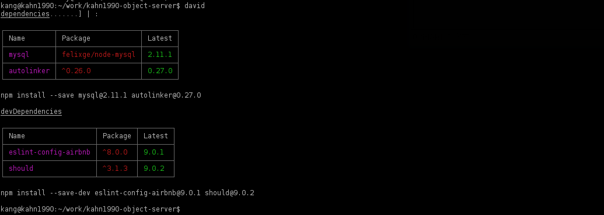

# 规范化安全开发 KOA 手脚架

刚接触 KOA 的时候心理也有一点点担忧，KOA 是一个轻量级的框架，这意味着我们想要做好一个理想的手脚架需要自己去改变很多东西，一些流行的 npm 第三方更要做好处理，那么时间成本会逐级的提高。

[koa-rack](https://github.com/kahn1990/koa-rack)

## 项目目录

```js
.
├── app.js
├── config
├── controllers
├── doc
├── dox.config.json
├── ecosystem.json
├── index.js
├── jsdoc-conf.json
├── lib
├── log4js
├── Makefile
├── models
├── node_modules
├── npm-shrinkwrap.json
├── oneapm.js
├── package.json
├── proxy
├── README.md
├── routes
├── server
├── sql
├── start.sh
├── static
├── test
├── views
└── webpack.config.js
```

### config

> npm i config --save

`config` 这个文件夹的作用是用来做开发环境、生产环境和测试环境的配制工作，依赖于 `config` 组件，目录下以此建立相关的配置文件：

```js
.
├── default.json
├── development.json
├── production.json
├── readme.md
└── test.json
```
在 `json` 后缀的文件无法做注释，所以添加 `readme.md` 文件做配置文件的说明。这个只是我自己的习惯，实际上 `config` 组件支持多种文件格式，它的机理就是通过判断 `NODE_ENV` 然后分别加载 `config` 文件夹下的文件。

### doc

> npm i json-zero -g

文档文件夹。这里我采用 `json-zero` 组件进行注释文档生成。

### lib

函数文件夹。

### log4js

> npm i log4js --save

扩展 log4js 的日志输出，这里面还是有一点门道的，因为 KOA 与 EXPRESS 并不相同，所以想要在 KOA上合理的使用 log4js 是要下一点心思去二次封装一下，以便适应自己的项目。

### controllers

`controllers` 文件夹保存控制器

```js
.
└── web
    └── user
        └── index.js
```
控制器通过 `yield` 来读取 `User` 内的数据
```
const User   = require('../../../models/web/index');
module.exports.home = function*() {
    var data = yield User.test({});
};
```
### routes
```
.
├── index.js
└── web
```
路由器文件夹，定义 `http` 的请求指向控制器：
```
const router = require('koa-router')(),
      debug  = require('debug')('app:routes:index');
/**
 * 引入控制器
 */
var Web = require('./../controllers/web/user/index');
/**
 * 主页
 */
router.get('/', Web.home);
module.exports = router;
```
### views
```
.
├── 400.html
├── 500.html
└── home.html
```
视图文件夹。

### models

数据层文件夹。
```
.
├── db
│   ├── mysql_orm.js
│   └── mysql_pool.js
└── web
    ├── index.js
    └── table
        ├── index.js
        └── photo.js
```
`db` 文件夹定义两种连接 `mysql` 的方式，`web` 里面就是具体的业务代码。

以上四个文件组成了这个手脚架的基础业务处理逻辑：


这个架构过程是灵活多变的，完全可以根据自己的需要进行取舍和重构，我只所以将路由和控制器分开成两个文件夹，更多的是考虑到当一个项目区分 n 个模块的时候，彼此之间相互独立却又有一些相同的 api 接口，那么这样架构可以更清晰的区分和查找接口。

我在15年和16年上半年之间经历过一个项目，使用 node 做中间层，本来一切顺利，但是苦于后端 java 根据业务调整频繁更换和更改 api 接口，造成了非常大的重复工作。渐渐的我就摸索出一套设计中间层的经验，在我们直接引用外部 api 接口之前，不要相信它是一成不变的，不要相信它是永远存在的，不要相信它是必要的。在此基础上根据功能分成若干模块，稍微费点心力进行二次封装然后再进行引用，封装的时候尽量考虑他不是唯一接口，并提供便捷和可替换性。

## 入口文件

入口文件将它拆分为几个部分：
```
.
├── app.js
├── index.js
├── Makefile
├── server
│   ├── api
│   ├── auth
│   ├── index.js
│   ├── lib
│   │   ├── compose.js
│   │   ├── cors.js
│   │   ├── etag.js
│   │   ├── fresh.js
│   │   ├── gzip.js
│   │   └── ketag.js
│   └── middleware
│       ├── helmet_set.js
│       └── index.js
├── start.sh
└── static
```
这里我需要吐槽一下 grunt 和 gulp，发明 grunt 和 gulp 的人一定是天才，但是它俩真的没有想象中那么好用，我宁愿使用 npm script 或者 makefile。
因为 KOA 的 generator 相关的特性，我们必须将很多流行的第三方进行改造，我建议不要去找 npm 库里的那些已经改造好的组件，那些大多版本落后，自力更生比较好一些。

## 安全相关

### helmet

helmet 是一个很流行的组件，用于处理一些常见的安全问题。

### etag

处理静态资源响应时间。

## 一些细节


### [Node Security project(nsp)](https://github.com/nodesecurity/nsp)

检查你使用的模块是否是易被一些已知的手段攻击，可以给一个包的所有依赖关系上锁，并且创建一个 `npm-shrinkwrap.json` 文件。
  
> $ npm install -g nsp nsp-formatter-checkstyle

写入：

> $ npm shrinkwrap


如果想要包含 dependencies and devDependencies 需要添加 `--dev`:

> $ npm shrinkwrap --dev

检查：

> $ nsp check --output summary
    
    
    
> $ nsp check --output checkstyle

在根目录下创建 `.nsprc` 文件：
 
### retire.js

retire.js是一个命令行扫描器，帮助你找到你应用中依赖库存在的漏洞。
  
### requiresafe

- https://requiresafe.com/

### [david](https://www.npmjs.com/package/david)

> $ npm install david -g

检查更新，执行命令

> david



检查全局模块

> $ david -g


### [`npm outdated`](https://docs.npmjs.com/cli/outdated)

> $ npm outdated


> $ npm outdated -g --depth 0


## 其他
想要写好写详细一点，但是没什么心情，这些内容半个月前我就基本整理好了代码逻辑，本来想着好好写一篇安全相关的文章，中间去面了一家公司...阿里系的公司，满怀着随便试试的心情去的，不管怎么样我和一面的工程师聊的还是很开心的，起码我自己有一些收获，厄运从二面就开始，一个个子不高的总监，说心里话我对公司和面试并不排斥，这本来就是一个双向选择的过程，但是这个总监从开始的侧作者身子眼睛都不抬的的随便问问，那种藐视感真的挺难受的，我觉得不管大公司也好小公司也好，起码对人、对物可以不赞同但起码要有最基本的尊重。

没错我就是玻璃心，我没经历过什么大风大浪，我工作的这几家公司，第一家老东家是我所尊重的，第二家相当于的百度系的一个高工创业半挖我过去的，第三个的老大也是美国硅谷工作10多年的华人把我带到了她的公司，我不觉得这几家的我的老大会比这个阿里系的面试官水平差，哪怕他是总监，这个岁月总监级别的人不要太多了好吧。

我有点阿里黑了，或者说不是阿里黑而是有点惧怕阿里系了
