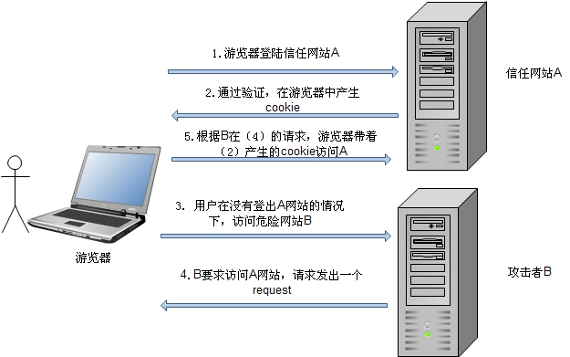
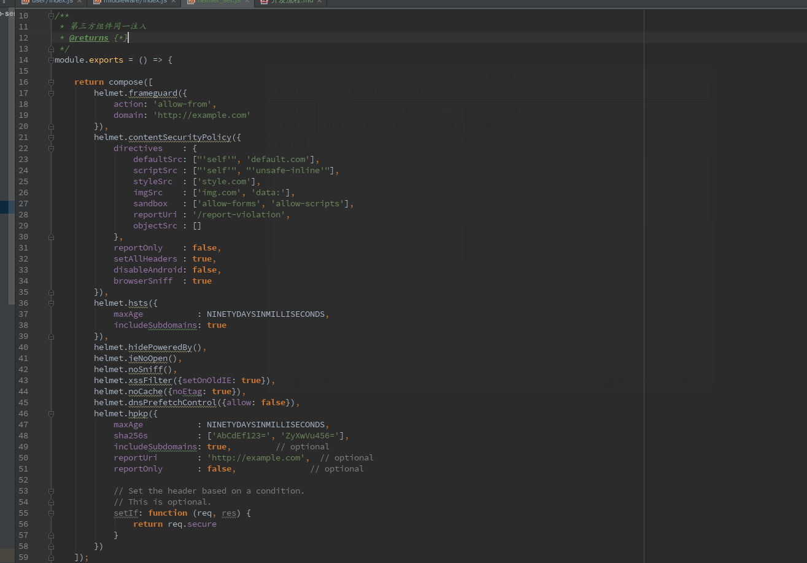
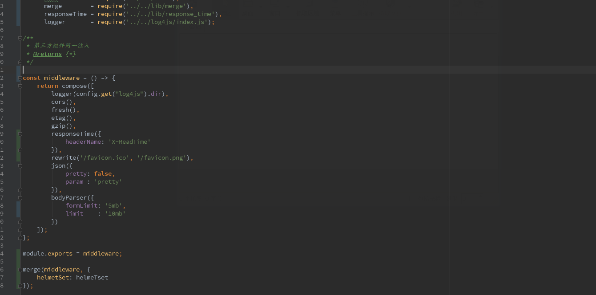
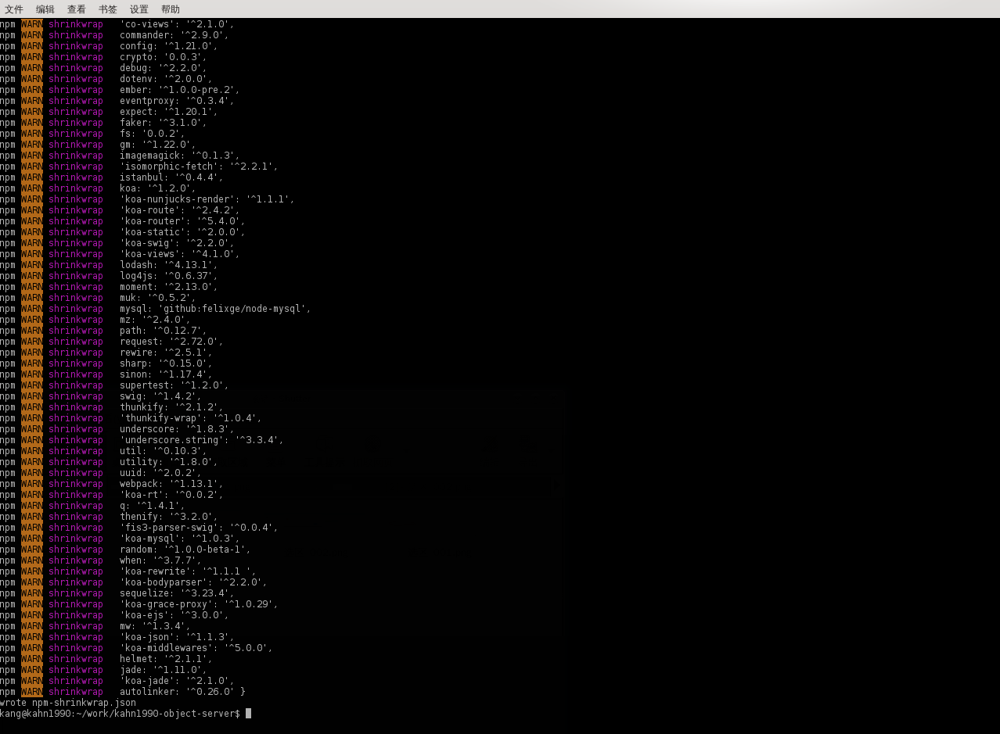
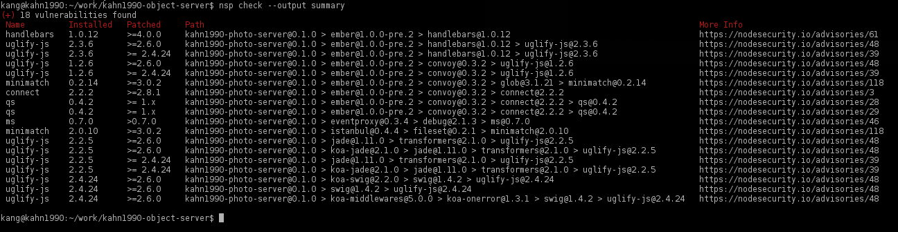
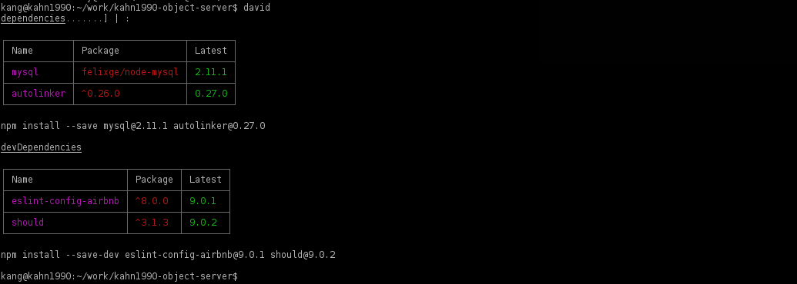
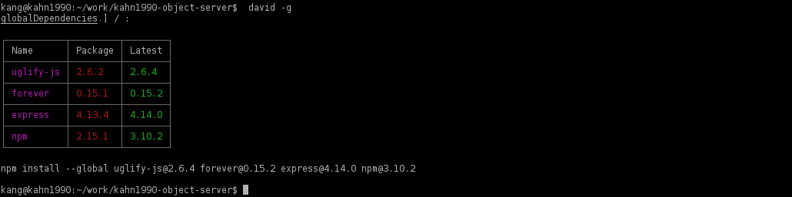
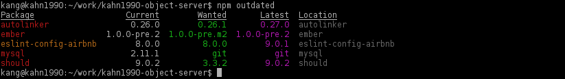
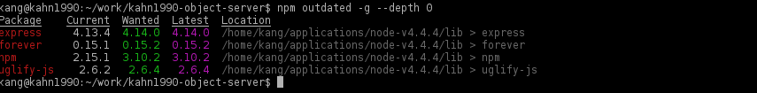

# KOA 安全开发实例

具体相关代码在。。。。。

# 跨站请求伪造 CSRF（Cross-Site Request Forgery）

CSRF 是一种挟制终端用户在当前已登录的Web应用程序上执行非本意的操作的攻击方法。
更具体的可以参考 [浅谈 CSRF](http://www.cnblogs.com/hyddd/archive/2009/04/09/1432744.html) 或者 [CSRF 攻击的应对之道](http://www.ibm.com/developerworks/cn/web/1102_niugang_csrf/)。

（请原谅我的盗图，程序员的盗图能叫盗么 (╬▔▽▔)凸，只是偶尔犯了懒癌不愿意自己画好不好 (╬▔▽▔)凸 (╬▔▽▔)凸）

## 同步令牌模式（Synchronizer Token Pattern）

- 当一个 GET 请求被服务检查为 CSRF 令牌，如果不存在，就创建一个
- 当用户输入显示时，确保要添加一个隐形的 CSRF 令牌值
- 当发送表单时，确保值是来自表单并且要与 session 相匹配

常见的第三方集成：

- [csurf](https://www.npmjs.com/package/csurf)
    - `$ npm i csurf --save`
- [koa-csrf](https://github.com/koajs/csrf)
    - `$ npm install koa-csrf`

这里我使用的是 koa-csrf。

# [Helmet](https://www.npmjs.com/package/helmet)

- `$ npm install helmet --save`

Helmet 安全功能有:

- [contentSecurityPolicy](https://github.com/helmetjs/csp) 通过设置Content-Security-Policy来阻止XSS攻击和一些其他的跨站注入风险
    - 内容安全策略（CSP）：CSP（Content Security Policy）是一个额外添加的安全层，它有助于检测和减轻某些类型的攻击，包括跨站脚本（XSS）和数据注入攻击。 通过HTTP header中的Content-Security-Policy方法来启动CSP。
        - https://www.owasp.org/index.php/Testing_for_Reflected_Cross_site_scripting_%28OWASP-DV-001%29
- [dnsPrefetchControl](https://github.com/helmetjs/dns-prefetch-control) controls browser DNS prefetching
- [frameguard](https://github.com/helmetjs/frameguard) 设置X-Frame-Options阻止点击劫持风险
- [hidePoweredBy](https://github.com/helmetjs/hide-powered-by) 删除了header中的X-Powered-By标签
    - `app.disable('x-powered-by');`：禁用X-Powered-By头
        - http://scottksmith.com/blog/2014/09/21/protect-your-node-apps-noggin-with-helmet/
- [hpkp](https://github.com/helmetjs/hpkp) 通过增加Public key Pinning来阻止伪造证书导致的中间人攻击
- [hsts](https://github.com/helmetjs/hsts) 设置 Strict-Transport-Security 来强制安全连接(http over SSL)到服务器（服务器需要支持https）
- [ieNoOpen](https://github.com/helmetjs/ienoopen) 为ie8设置 X-Download-Options
- [noCache](https://github.com/helmetjs/nocache) 设置Cache-Control关闭客户端缓存
- [noSniff](https://github.com/helmetjs/dont-sniff-mimetype) 设置X-Content-Type-Options阻止浏览器MIME-sniffing。
- [xssFilter](https://github.com/helmetjs/x-xss-protection) 设置X-XSS-Protection启用XSS过滤器
- [dnsPrefetchControl](https://github.com/helmetjs/dns-prefetch-control) DNS 

用法：

调用 `app.use(helmet());` 可以缺省激活上述 10 项功能的7项，排除的两项是 `contentSecurityPolicy` 、 `dnsPrefetchControl`和 `noCache`。

为了迎合新版本的 Helmet，我不得不放弃 koa-helmet，koa-helmet 依赖的 Helmet 版本太低了，所以只好自己 copy 一个文件加工成中间件：

再绑定到 middleware 上：

以下是一些安全性相关的HTTP头：

- Strict-Transport-Security：强制使用安全连接（SSL/TLS之上的HTTPS）来连接到服务器。
- X-Frame-Options：提供对于“点击劫持”的保护。
- X-XSS-Protection：开启大多现代浏览器内建的对于跨站脚本攻击（XSS）的过滤功能。
- X-Content-Type-Options： 防止浏览器使用MIME-sniffing来确定响应的类型，转而使用明确的content-type来确定。
- Content-Security-Policy：防止受到跨站脚本攻击以及其他跨站注入攻击。

# 身份认证

## 暴力破解的保护

- [ratelimiter](https://www.npmjs.com/package/ratelimiter)
- [koa-ratelimit](https://www.npmjs.com/package/koa-ratelimit)

通过限制用户的连接频率来防止这类的攻击:

    var ratelimit = require('koa-ratelimit');  
    var redis = require('redis');  
    var koa = require('koa');  
    var app = koa();
    
    var emailBasedRatelimit = ratelimit({  
      db: redis.createClient(),
      duration: 60000,
      max: 10,
      id: function (context) {
        return context.body.email;
      }
    });
    
    var ipBasedRatelimit = ratelimit({  
      db: redis.createClient(),
      duration: 60000,
      max: 10,
      id: function (context) {
        return context.ip;
      }
    });
    
    app.post('/login', ipBasedRatelimit, emailBasedRatelimit, handleLogin); 
    
## 其他

- [StrongLoop API Gateway](https://strongloop.com/node-js/api-gateway/?_ga=1.201809873.1196661681.1453521338) ：使用提交速率限制，防止蛮力攻击
- [express-limiter](https://www.npmjs.com/package/express-limiter) ：使用提交速率限制，防止蛮力攻击
- [thc-hydra](https://github.com/vanhauser-thc/thc-hydra) ：提交限制测试

#  Session、Cookie

> $ npm install koa-session
    
## cookie可以设置的属性的列表：

- secure - 这个属性告诉浏览器，仅在请求是通过HTTPS传输时，才传递cookie。
- HttpOnly - 设置这个属性将禁止javascript脚本获取到这个cookie，这可以用来帮助防止跨站脚本攻击。
- Cookie域
    - domain - 这个属性用来比较请求URL中服务端的域名。如果域名匹配成功，或这是其子域名，则继续检查path属性。
    - path - 除了域名，cookie可用的URL路径也可以被指定。当域名和路径都匹配时，cookie才会随请求发送。
    - expires - 这个属性用来设置持久化的cookie，当设置了它之后，cookie在指定的时间到达之前都不会过期。

示例代码：

    app.use(session({
            overwrite: true,
            httpOnly : true,
            signed   : true,
            key      : 'kos',
            maxAge   : 1000 * 3600 * 24 * 30
        },
        app
    ));

# 数据合法性

##  XSS

- 跨站脚本
- 存储

非持久化的XSS攻击 在攻击者向指定的URL的响应HTML中注入可执行的JavaScript代码时发生。
持久化的XSS攻击 在应用存储未经过滤的用户输入时发生。用户输入的代码会在你的应用环境下执行。
为了防御这类攻击，请确保你总是检查并过滤了用户的输入内容。

## SQL注入

最简单的预防方法则是使用参数化查询（parameterized queries）或预处理语句（prepared statements）。

### [sqlmap](http://sqlmap.org/)

sqlmap 可以检测是否存在sql注入的风险。这里有一篇教程 http://www.freebuf.com/articles/web/29942.html

https://asciinema.org/a/46601

### orm2

mysql orm 服务。

# 安全传输

- nmap
- sslyze

检查证书信息

> $ nmap --script ssl-cert,ssl-enum-ciphers -p 443,465,993,995 www.example.com

或者：

> $ ./sslyze.py --regular example.com:443

# 正则表达式（Evil Regexes）

## [safe-regex](https://www.npmjs.com/package/safe-regex)

可以确保你的正则表达式不会成为正则表达式DOS攻击的受害者

## SSL

- [namp](https://nmap.org/) ：测试你的SSL配置以及验证认证的有效性
- [sslyze](https://github.com/nabla-c0d3/sslyze) ：测试你的SSL配置以及验证认证的有效性

## NPM

### [Node Security project(nsp)](https://github.com/nodesecurity/nsp)

检查你使用的模块是否是易被一些已知的手段攻击，可以给一个包的所有依赖关系上锁，并且创建一个 `npm-shrinkwrap.json` 文件。
  
> $ npm install -g nsp nsp-formatter-checkstyle

写入：

> $ npm shrinkwrap

如果想要包含 dependencies and devDependencies 需要添加 `--dev`:

> $ npm shrinkwrap --dev

检查：

> $ nsp check --output summary
    
    
    
> $ nsp check --output checkstyle

在根目录下创建 `.nsprc` 文件：
 
### retire.js

retire.js是一个命令行扫描器，帮助你找到你应用中依赖库存在的漏洞。
  
### requiresafe

- https://requiresafe.com/

### [david](https://www.npmjs.com/package/david)

> $ npm install david -g

检查更新，执行命令

> david

检查全局模块

> $ david -g

### [`npm outdated`](https://docs.npmjs.com/cli/outdated)

> $ npm outdated

> $ npm outdated -g --depth 0

# 备注

- https://www.owasp.org/index.php/Web_Application_Security_Testing_Cheat_Sheet ：安全清单
- https://nodesecurity.io/ ：NPM 审核
- http://martinfowler.com/bliki/TestPyramid.html ：测试清单
- https://github.com/expressjs/session?_ga=1.233780062.1196661681.1453521338#compatible-session-stores ：兼容的会话存储列表
- https://www.owasp.org/index.php/Regular_expression_Denial_of_Service_-_ReDoS ：正则表达式DOS攻击
- https://nodesecurity.io/advisories
- https://wiki.mozilla.org/Security/Server_Side_TLS#Recommended_Server_Configurations ：推荐的服务器配置
- https://www.owasp.org/index.php/XSS_(Cross_Site_Scripting)_Prevention_Cheat_Sheet

nginx 配置相应头：

    # nginx.conf
    
    add_header X-Frame-Options SAMEORIGIN;  
    add_header X-Content-Type-Options nosniff;  
    add_header X-XSS-Protection "1; mode=block";  
    add_header Content-Security-Policy "default-src 'self'"; 
    
- https://gist.github.com/plentz/6737338 ： 参考这个nginx配置
- http://cyh.herokuapp.com/cyh : 网站是否都设置这些HTTP头